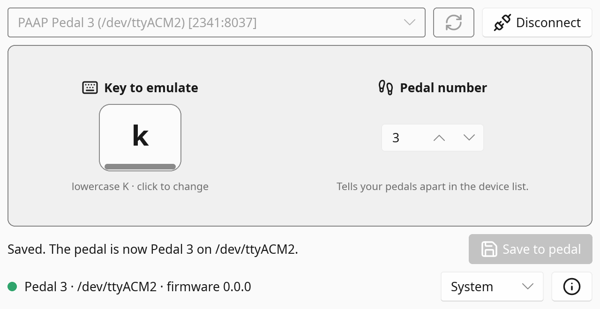

<div align="center">


# PAAP

### Perfectly Adequate Arcade Pedal

**Turn an arcade foot pedal into a USB keyboard key: plug-and-play firmware plus a desktop app to pick the key and number up to 16 pedals.**

[](https://github.com/tbreckle/paap_pedal_software/actions/workflows/ci.yml)
[](https://github.com/tbreckle/paap_pedal_software/releases)
[](LICENSE)


[**Download**](https://github.com/tbreckle/paap_pedal_software/releases) ·
[Features](#-features) ·
[Quick start](#-quick-start) ·
[Multiple pedals](#-multiple-pedals) ·
[Troubleshooting](#-troubleshooting) ·
[Building](#-building-from-source)

</div>

---

## 🦶 What is this?

The **PAAP** is a small USB foot pedal for arcade setups. It shows up as a plain **USB keyboard**, so every game, emulator and operating system understands it without drivers: press the pedal, and it presses a key.

This repository contains an alternative **firmware** for the mini PAAP and the **PAAP Configurator** app to choose which key it presses. The hardware is designed by JayBomb999 and [available on Ko-fi](https://ko-fi.com/s/10c3e43f22).

| | Component | Stack |
|---|---|---|
| 🧠 | [**Firmware**](firmware/) | C++ / Arduino on an ATmega32U4 (Arduino Micro) |
| 🖥️ | [**Configurator**](app/) | Rust + [Slint](https://slint.dev), native on Linux, Windows and macOS |

<div align="center">

</div>

## ✨ Features

<table>
<tr>
<td width="50%" valign="top">

#### 🎮 Pedal
- **Plug and play**: USB HID keyboard, no drivers needed
- **Any key**: letters, digits, space and symbols; default is `l`
- **Remembers its settings** in EEPROM, even when unplugged
- **Pedal number 1–16**: tell several pedals apart in the app and the OS

</td>
<td width="50%" valign="top">

#### 🖥️ Configurator
- **Press a key to bind it**: click the keycap, press the key, save
- **Finds your pedals**: numbered pedals first, with port and `[VID:PID]`
- **Hot-plug aware**: the device list refreshes while disconnected
- **Light / Dark / System** themes

</td>
</tr>
</table>

**Perfect for** light gun games (reload pedal), racing simulators (clutch, brake, gear shift), accessibility (hands-free input) and streaming (push-to-talk, scene switching).

## 🚀 Quick start

1. **Grab the latest release** from the [Releases page](https://github.com/tbreckle/paap_pedal_software/releases):

   | File | What it is |
   |---|---|
   | `paap-firmware-X.Y.Z.hex` | Firmware for the pedal |
   | `paap-configurator-X.Y.Z-windows-x86_64.zip` | Configurator for Windows |
   | `paap-configurator-X.Y.Z-linux-x86_64.tar.gz` | Configurator for Linux |
   | `paap-configurator-X.Y.Z-macos-universal.tar.gz` | Configurator for macOS (Apple Silicon + Intel) |

2. **Plug in the pedal.** It works right away and types `l`.
3. **Run the configurator** (no installation needed), pick your pedal and click **Connect**.
   - **Linux:** `tar -xzf paap-configurator-*-linux-x86_64.tar.gz && ./paap-configurator-*/paap-configurator`
   - **macOS:** the app is unsigned; on the first start, right-click → **Open**.
4. **Click the keycap, press the key** the pedal should send, and click **Save to pedal**. Done!

> [!TIP]
> Use the configurator and firmware from the **same release**. Builds labeled `0.0.0+<commit>` are unofficial development builds.

## 🦶🦶 Multiple pedals

All pedals are the same board, so without help they look identical to your computer ("Arduino Micro", same USB IDs). Give each pedal its own **pedal number** from 1 to 16:

1. Connect to a pedal, set **Pedal number**, and click **Save to pedal**.
2. The pedal briefly reconnects and then shows up as **`PAAP Pedal 2 (COM5) [2341:8037]`**; the app reconnects automatically.

The number is part of the pedal's USB serial number (`…PAAP02`), so other tools can tell your pedals apart too, for example through `/dev/serial/by-id/` on Linux. Pedals with the 1.0 firmware can't store a number yet; update their firmware first.

## ❓ Troubleshooting

<details>
<summary><b>The pedal doesn't type anything</b></summary>

- Check that the USB cable is fully plugged in, or try a different USB port or cable.
- Make sure the pedal hardware is properly assembled.
- Unplug and replug the pedal.

</details>

<details>
<summary><b>My pedal doesn't show up in the configurator</b></summary>

- Make sure it's plugged in; the list refreshes every 2 seconds (or click the refresh button).
- **Linux:** add yourself to the `dialout` group once, then log out and back in:
  ```bash
  sudo usermod -a -G dialout $USER
  ```

</details>

<details>
<summary><b>Can't connect, or saving fails</b></summary>

- Close other programs that might be using the pedal's serial port.
- Unplug and replug the pedal, then connect again.
- After changing the pedal number, Windows may give the pedal a new COM port; that's expected.

</details>

More technical details are in [DEV.md](DEV.md).

## 🔧 Building from source

<details>
<summary><b>🖥️ Configurator (Rust)</b></summary>

**Requirements:** [Rust](https://rustup.rs/); the toolchain (1.98) is pinned in `app/rust-toolchain.toml` and installed automatically. On Linux you also need `libudev-dev`, `libfontconfig-dev` and `pkg-config`.

```bash
cd app
cargo run --release     # build and launch
cargo test              # unit tests
cargo clippy            # lint (warnings fail CI)
cargo fmt --check       # formatting check
```

</details>

<details>
<summary><b>🧠 Firmware (Arduino)</b></summary>

**Requirements:** Arduino AVR Boards core **1.8.6**, libraries **Bounce2 2.71.0** and **Keyboard 1.0.6**.

```bash
arduino-cli compile --fqbn arduino:avr:micro firmware/
arduino-cli upload  --fqbn arduino:avr:micro -p /dev/ttyACM0 firmware/
```

With the Arduino IDE: open `firmware/firmware.ino`, select **Arduino Micro**, and upload. The serial protocol and all other details are in [DEV.md](DEV.md).

</details>

<details>
<summary><b>🗂️ Repository layout</b></summary>

```
paap_pedal_software/
├── firmware/              # Arduino/C++ firmware for the ATmega32U4
├── app/                   # Rust/Slint configurator
│   ├── ui/app.slint       # UI definition
│   └── src/               # ui.rs, serial.rs, config.rs
├── images/                # App icon and screenshot
├── scripts/               # version.sh, changelog.sh, test.sh
└── .github/workflows/     # CI, release-start, release-finish
```

</details>

## 🤝 Contributing

Contributions are welcome! The project uses **GitFlow**: branch `feature/*` off `develop` and open a PR back to `develop`. CI builds the app on all three platforms, builds the firmware and runs the linters on every push.

- 📖 [GITFLOW.md](GITFLOW.md): branching, versioning and releases
- ⚙️ [.github/WORKFLOWS.md](.github/WORKFLOWS.md): the CI/CD pipelines
- 📝 [CHANGELOG.md](CHANGELOG.md): add your change under `## [Unreleased]`

## 📜 License & credits

PAAP firmware and configurator are released under the [MIT License](LICENSE).

- 🔩 Hardware design: **JayBomb999**, [available on Ko-fi](https://ko-fi.com/s/10c3e43f22)
- 🎨 Button icons: [Lucide](https://lucide.dev) ([ISC License](app/ui/icons/LICENSE))

### Made with Slint

<a href="https://slint.dev">
  <picture>
    <source media="(prefers-color-scheme: dark)" srcset="https://slint.dev/logo/MadeWithSlint-logo-dark.svg">
    
  </picture>
</a>

The configurator's user interface is built with [Slint](https://slint.dev), used under the [Slint Royalty-free Desktop, Mobile, and Web Applications License 2.0](https://github.com/slint-ui/slint/blob/master/LICENSES/LicenseRef-Slint-Royalty-free-2.0.md). The app also shows the Slint attribution in its **About** dialog.

<details>
<summary><b>⚖️ Legal disclaimer</b></summary>

**USE AT YOUR OWN RISK.** This software and firmware are provided "AS IS" without warranty of any kind, express or implied, including but not limited to the warranties of merchantability, fitness for a particular purpose, and non-infringement.

- The developers and contributors of this project assume **no liability** for any damages, losses, or issues arising from the use, misuse, or inability to use this software or hardware.
- This includes, but is not limited to: hardware damage, data loss, system malfunction, or any other direct or indirect consequences.
- By using this software, you acknowledge that you do so at your own risk.
- Users are responsible for ensuring compatibility with their systems and compliance with local regulations.
- This project is an independent effort and is not affiliated with or endorsed by any hardware manufacturer unless explicitly stated.

This project is intended for personal, educational, and hobbyist use. Users modifying firmware or hardware configurations should have appropriate technical knowledge and accept full responsibility for their modifications.

</details>

---

<div align="center">

**🪙 INSERT COIN TO CONTINUE 🪙**

<sub>Built for lightgun and arcade fans.</sub>

</div>
